# Лабораторная работа по исследованию иерархии кешей

## 1. Цель работы

Экспериментально исследовать зависимость числа попаданий в кеш от распределения запросов, порядка обращений и ёмкости. Сравнить реализации LRU, LFU, ARC, 2Q, LIRS и Белади из данного проекта; найти для каждого алгоритма нагрузку, на которой проявляется его преимущество; проверить несколько двухуровневых иерархий.

Работа выполнена на синтетических данных. Все приведённые числа получены запуском C++-кода проекта, а не теоретической оценкой. Отчёт относится к состоянию исходных реализаций на коммите `21e58781f9e73f56b369835f27e8c5a08dc81b11`. Алгоритмы в `include/` при подготовке работы не изменялись.

## 2. Методика эксперимента

Основная ёмкость — **C = 100**. Каждый алгоритм получает одну и ту же последовательность ключей и начинает с пустого кеша. Прогрев, если он есть в датасете, входит в число запросов и итоговую статистику. Значение равно ключу; медленный загрузчик считает обращения к источнику данных. Каждый запуск создаёт новый объект кеша.

Использованы следующие показатели:

- **N** — число запросов;
- **M** — число промахов и вызовов загрузчика;
- **H = N − M** — число хитов;
- **hit rate = 100 · H / N** — доля хитов в процентах;
- **ΔH** — преимущество победителя над ближайшим соперником.

На столбчатых гистограммах показаны абсолютные числа хитов для `seed = 0`. Сравнивать высоты столбцов следует внутри одного датасета: длины разных последовательностей различаются. Для случайных нагрузок дополнительно выполнены десять запусков с `seed = 0…9`; ниже приведены среднее и выборочное стандартное отклонение доли хитов. Это разброс по последовательностям, а не погрешность замера времени. Время исполнения и задержки памяти в этой работе не измеряются.

**Особенность ёмкости 2Q.** При параметре C = 100 реализация выделяет 10 мест для IN, 30 для OUT и 60 для LRU. OUT хранит только ключи: одновременно резидентны не более 70 значений. LRU, LFU, ARC и LIRS при этом допускают 100 значений; ARC и LIRS тоже имеют служебную историю. Основное сравнение использует одинаковый параметр конструктора и характеризует реализации проекта. Это не сравнение при одинаковом количестве байтов памяти. Дополнительная проверка 2Q с C = 143 даёт 99 резидентных значений и вынесена в раздел 8.

Параметры демонстрационных сценариев выбраны после предварительных проб, чтобы выявить сильные стороны разных алгоритмов, затем зафиксированы и проверены на десяти seed. Это целевые примеры, а не случайная выборка всех возможных нагрузок. По ним нельзя объявить какой-либо кеш универсально лучшим.

## 3. Датасеты и распределения

Важно различать частоту ключей и временной порядок. Даже равные частоты могут соответствовать случайному потоку, циклу или длинным сериям повторов; кеш реагирует на эти последовательности по-разному.

Во всех описаниях диапазоны включают левую границу и не включают правую. Случайный выбор равномерный, если не указано иное. Генератор использует отдельный `random.Random(seed)` для каждого датасета.

| ID | Закон формирования |
| --- | --- |
| `uniform` | 20 000 независимых запросов из `[0,400)`, P(k) = 1/400 |
| `zipf` | 20 000 независимых запросов из `[0,400)`, P(k) = (k+1)^−1.2 / Σ(j+1)^−1.2 |
| `normal` | Нормальные случайные числа с μ = 199.5, σ = 60; округление `round`, отбрасывание значений вне `[0,400)` до получения 20 000 запросов |
| `scan` | Ключи 0…19 999 по одному разу; повторного использования нет |
| `lru` | Прогрев: четыре прохода по 48 ключам. Затем 40 циклов: 144 случайных обращения к этому ядру и пять проходов по новому блоку из 100 ключей |
| `lfu` | Прогрев: четыре прохода по 89 ключам. Затем 30 циклов: 445 случайных обращений к ядру и сканирование 54 новых ключей, каждый два раза подряд |
| `arc` | Прогрев: десять проходов по 100 старым ключам. Затем четыре фазы по 3100 событий: с вероятностью 0.23 один запрос к случайному ключу нового ядра из 53 ключей, иначе два запроса подряд к новому уникальному ключу |
| `twoq` | Такой же прогрев и тип смеси, но четыре фазы по 4500 событий, вероятность обращения к ядру 0.40, размер ядра 45 |
| `lirs` | Прогрев: четыре прохода по 18 ключам. Затем 40 циклов: 54 случайных обращения к ядру и семь проходов по новому блоку из 103 ключей |
| `belady` | 200 последовательных проходов по ключам 0…100, то есть цикл длиной C + 1 |

В `arc` и `twoq` ядра разных фаз не пересекаются, старые ключи больше не запрашиваются. Число событий фиксировано, число запросов зависит от количества двухэлементных серий. В блочных сценариях новые блоки также не пересекаются с ядром и друг с другом. Точные формулы идентификаторов находятся в [генераторе](../experiments/run.py).

Фактические размеры основных датасетов:

| Датасет | N | Уникальных ключей | Файл |
| --- | --- | --- | --- |
| uniform | 20000 | 400 | [TXT](data/uniform.txt) |
| zipf | 20000 | 398 | [TXT](data/zipf.txt) |
| normal | 20000 | 371 | [TXT](data/normal.txt) |
| scan | 20000 | 20000 | [TXT](data/scan.txt) |
| lru | 25952 | 4048 | [TXT](data/lru.txt) |
| lfu | 16946 | 1709 | [TXT](data/lfu.txt) |
| arc | 22919 | 9831 | [TXT](data/arc.txt) |
| twoq | 29740 | 11020 | [TXT](data/twoq.txt) |
| lirs | 31072 | 4138 | [TXT](data/lirs.txt) |
| belady | 20200 | 101 | [TXT](data/belady.txt) |

Форма трёх вероятностных распределений показана по исходным ключам:

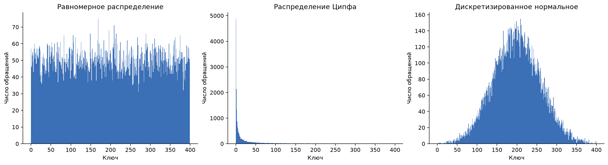

Для всех десяти датасетов дополнительно приведены частоты ключей по убыванию. Вертикальная шкала логарифмическая; горизонтальная — ранг ключа, а не его значение.

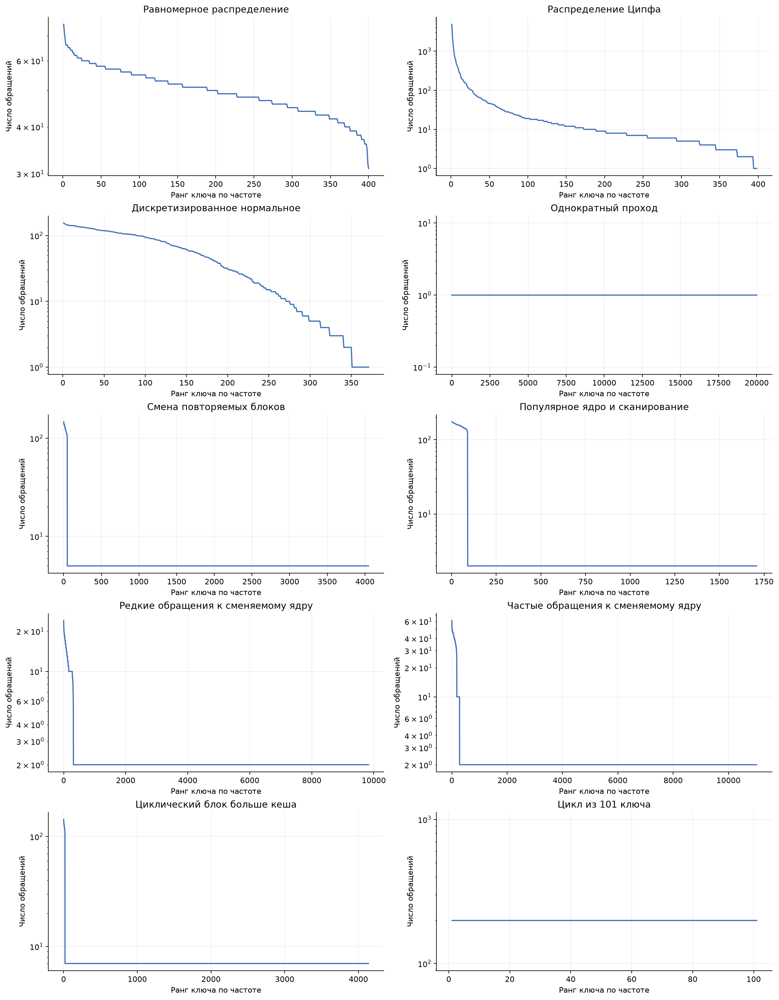

Временная структура последовательностей показана ниже. Для читаемости отображается примерно 2500 равномерно выбранных по позиции обращений из каждой последовательности; при расчёте хитов используются все запросы.

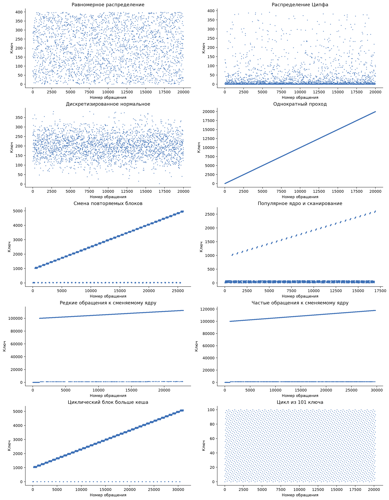

## 4. Результаты основных запусков

Число хитов при C = 100, seed = 0:

| Датасет | LRU | LFU | ARC | 2Q | LIRS | BELADY |
| --- | --- | --- | --- | --- | --- | --- |
| Равномерное | 5070 | 5114 | 5075 | 3476 | 5075 | 11951 |
| Ципфа | 16543 | 17149 | 16828 | 16160 | 16943 | 18193 |
| Нормальное | 9058 | 10314 | 9393 | 7179 | 9793 | 15113 |
| Однократный проход | 0 | 0 | 0 | 0 | 0 | 0 |
| Смена блоков (LRU) | 20122 | 5904 | 18401 | 5339 | 15546 | 20122 |
| Ядро + сканирование (LFU) | 13107 | 15237 | 13107 | 12058 | 12026 | 15237 |
| Редкое сменяемое ядро (ARC) | 11474 | 10429 | 11795 | 11065 | 10985 | 13088 |
| Частое сменяемое ядро (2Q) | 16372 | 11699 | 16442 | 17191 | 15236 | 18720 |
| Циклические блоки (LIRS) | 1543 | 2214 | 2214 | 1827 | 17605 | 25543 |
| Цикл 101 (Белади) | 0 | 0 | 0 | 0 | 15920 | 19899 |

### 5.1. Равномерное распределение

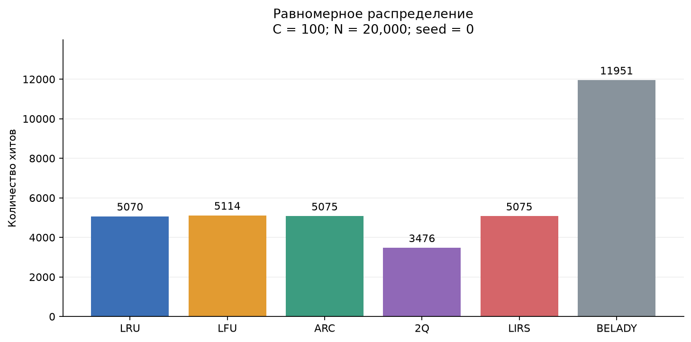

Для онлайн-кешей с 100 резидентными значениями доля хитов близка к 100/400 = 25% после начального заполнения. Здесь нет устойчиво более популярных ключей, поэтому различия LRU, LFU, ARC и LIRS малы. Более низкий результат 2Q согласуется с его 70 резидентными местами: 70/400 = 17.5%. Белади использует знание будущего и получает существенно больше хитов даже на случайной последовательности.

### 5.2. Распределение Ципфа

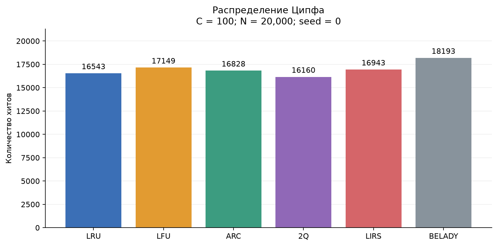

Небольшое число ключей получает большую долю запросов. LFU получает 17 149 хитов, LIRS — 16 943, ARC — 16 828, LRU — 16 543. Накопление частоты помогает LFU сохранять наиболее востребованные ключи. Это пример стационарного неравномерного распределения без специально заданных фаз.

### 5.3. Нормальное распределение

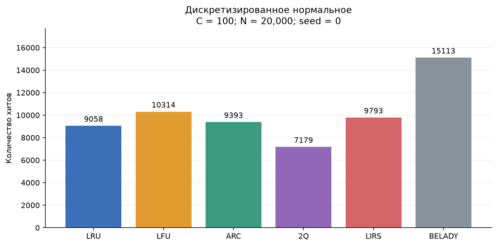

Вероятность ключей около центра выше, чем на краях. LFU снова лидирует среди онлайн-кешей: 10 314 хитов против 9793 у LIRS и 9393 у ARC. В отличие от Ципфа, популярность сосредоточена вокруг среднего значения. Числовая близость ключей сама по себе преимуществ не даёт: здесь кешируются отдельные ключи, без загрузки соседних адресов.

### 5.4. Однократный проход

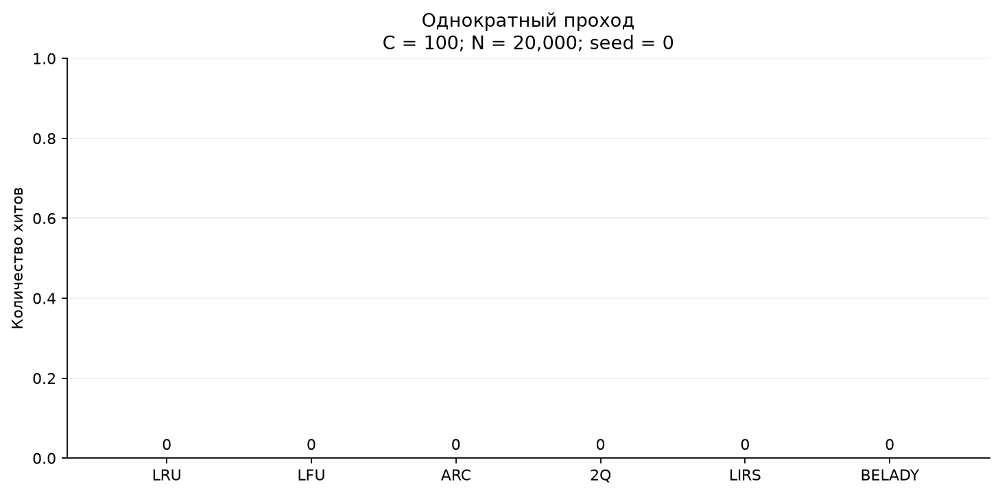

Все алгоритмы получают ноль хитов. Каждый ключ встречается впервые, поэтому даже знание будущего не помогает. Этот контрольный случай показывает, что кеширование требует повторного использования данных.

### 5.5. Сценарий преимущества LRU

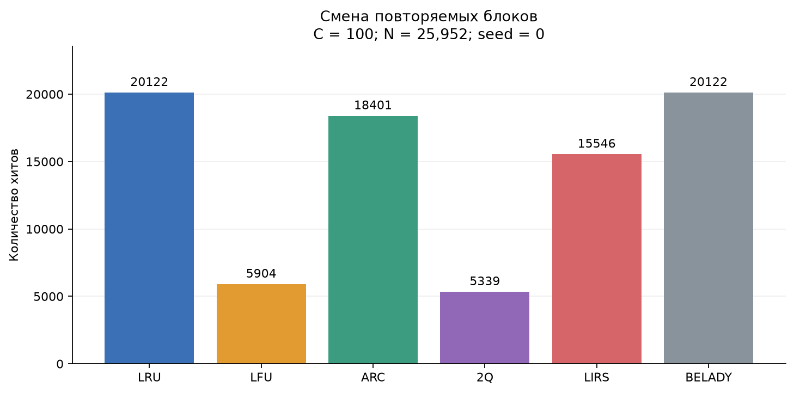

LRU получает **20 122** хита, ARC — 18 401; преимущество — **1721** хит. Результат LRU совпадает с Белади. Новый блок ровно помещается в кеш: после первого прохода следующие четыре обслуживаются из него. LRU быстро вытесняет прежние данные. LFU удерживает популярное ядро, отнимающее место у нового блока; у LIRS часть ёмкости защищена от быстрой замены. 2Q дополнительно ограничен малой входной очередью и правилами допуска в защищённую часть.

### 5.6. Сценарий преимущества LFU

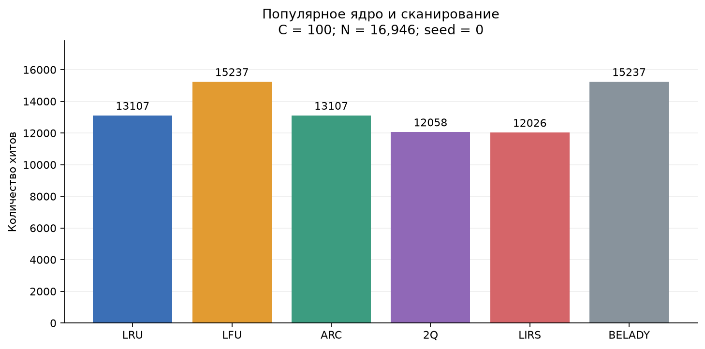

LFU получает **15 237** хитов, LRU и ARC — по 13 107; преимущество — **2130** хитов. Результат совпадает с Белади. Ядро из 89 ключей помещается в кеш и многократно используется. Новые ключи сканирования имеют лишь краткие двухэлементные серии: LFU сохраняет ядро благодаря накопленным частотам. В этом сценарии отсутствие старения частот полезно, потому что популярное ядро не меняется.

### 5.7. Сценарий преимущества ARC

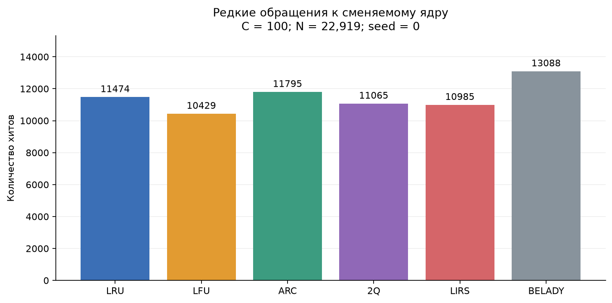

ARC получает **11 795** хитов, LRU — 11 474; преимущество — **321** хит. Переходы между ядрами делают старые частоты LFU бесполезными. Одновременно краткие повторные обращения к новым ключам мешают простому разделению на «повторные» и «однократные» запросы. Адаптивное управление двумя резидентными списками ARC оказывается полезным на данной смеси. Эффект умеренный: его следует оценивать вместе с повторными запусками, а не по одному графику.

### 5.8. Сценарий преимущества 2Q

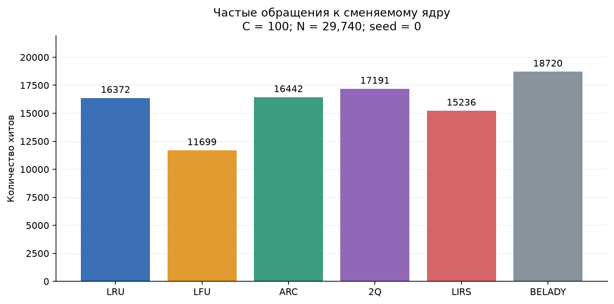

2Q получает **17 191** хит, ARC — 16 442; преимущество — **749** хитов, несмотря на меньшую резидентную ёмкость 2Q. Здесь ядро меньше и запрашивается чаще, чем в предыдущем сценарии. Оно имеет больше возможностей пройти из IN через OUT в защищённую LRU-часть. Два непосредственных обращения к новому ключу сами по себе не переводят его из IN в защищённую очередь. Поэтому краткие серии меньше загрязняют эту очередь. LFU плохо освобождает старое ядро после прогрева и смены фаз.

### 5.9. Сценарий преимущества LIRS

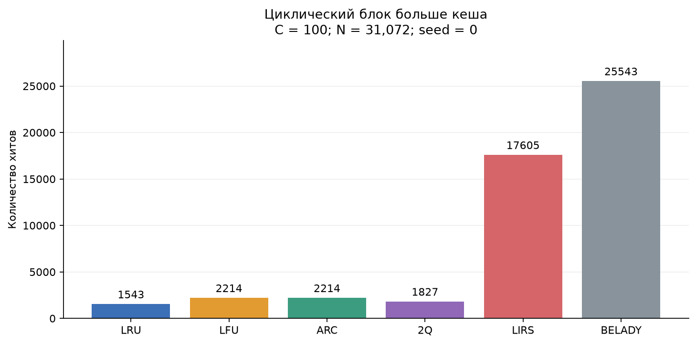

LIRS получает **17 605** хитов, LFU и ARC — по 2214; преимущество — **15 391** хит. Повторяемый блок из 103 ключей немного больше кеша. При последовательном цикле LRU вытесняет очередной нужный ключ непосредственно перед следующим обращением к нему. LIRS сохраняет защищённую часть блока между проходами, принимая промахи в менее защищённой части. Результат показывает устойчивость к этой конкретной циклической нагрузке, а не превосходство на любом сканировании.

### 5.10. Сценарий преимущества Белади

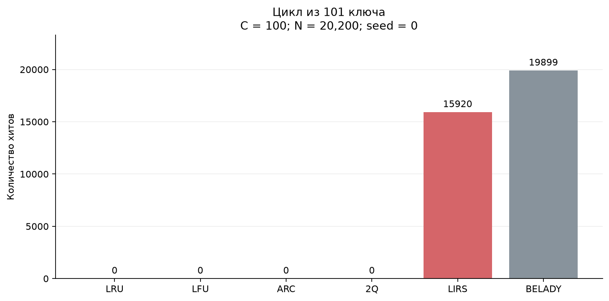

Белади получает **19 899** хитов, LIRS — 15 920; преимущество — **3979** хитов. LRU, LFU, ARC и 2Q получают ноль. Во входе 101 равночастотный ключ и 100 мест. Белади знает, какой ключ понадобится позже остальных, и сохраняет почти все ближайшие будущие обращения. LIRS тоже получает много хитов, защищая часть набора. Таким образом, одинаковые частоты ключей не означают одинаковую эффективность кеширования: решающую роль играет порядок.

## 5. Проверка требования о преимуществе каждого кеша

| Кеш | Датасет | Хиты | Ближайший соперник | Его хиты | ΔH, seed 0 | Победы | ΔH по seed |
| --- | --- | --- | --- | --- | --- | --- | --- |
| LRU | lru | 20122 | ARC | 18401 | 1721 | 10/10 | 1693…1758 |
| LFU | lfu | 15237 | LRU/ARC | 13107 | 2130 | 10/10 | 2108…2156 |
| ARC | arc | 11795 | LRU | 11474 | 321 | 10/10 | 309…377 |
| 2Q | twoq | 17191 | ARC | 16442 | 749 | 10/10 | 749…907 |
| LIRS | lirs | 17605 | LFU/ARC | 2214 | 15391 | 10/10 | 15385…15403 |
| BELADY | belady | 19899 | LIRS | 15920 | 3979 | 10/10 | 3979…3979 |

Для пяти онлайн-кешей соперниками в этой таблице являются только онлайн-кеши; для Белади — все остальные. `belady` детерминирован, поэтому его десять запусков идентичны и не являются десятью независимыми выборками.

Средняя доля хитов ± выборочное стандартное отклонение, в процентных пунктах, по десяти seed:

| Датасет | LRU | LFU | ARC | 2Q | LIRS | BELADY |
| --- | --- | --- | --- | --- | --- | --- |
| uniform | 24.93 ± 0.25 | 24.80 ± 0.50 | 24.90 ± 0.27 | 17.19 ± 0.23 | 24.91 ± 0.25 | 59.64 ± 0.11 |
| zipf | 82.53 ± 0.15 | 85.68 ± 0.29 | 84.21 ± 0.19 | 80.92 ± 0.19 | 84.64 ± 0.11 | 90.96 ± 0.09 |
| normal | 45.08 ± 0.27 | 51.20 ± 1.09 | 46.94 ± 0.33 | 35.47 ± 0.38 | 48.52 ± 0.35 | 75.35 ± 0.16 |
| scan | 0.00 ± 0.00 | 0.00 ± 0.00 | 0.00 ± 0.00 | 0.00 ± 0.00 | 0.00 ± 0.00 | 0.00 ± 0.00 |
| lru | 77.54 ± 0.03 | 22.75 ± 0.00 | 70.92 ± 0.11 | 20.56 ± 0.02 | 59.90 ± 0.06 | 77.54 ± 0.03 |
| lfu | 77.35 ± 0.09 | 89.92 ± 0.00 | 77.35 ± 0.09 | 70.89 ± 0.29 | 70.91 ± 0.19 | 89.92 ± 0.00 |
| arc | 50.05 ± 0.08 | 45.53 ± 0.09 | 51.52 ± 0.11 | 48.00 ± 0.25 | 47.89 ± 0.09 | 57.09 ± 0.10 |
| twoq | 54.85 ± 0.17 | 39.46 ± 0.13 | 55.10 ± 0.19 | 57.86 ± 0.21 | 51.02 ± 0.17 | 62.84 ± 0.14 |
| lirs | 4.97 ± 0.02 | 7.13 ± 0.00 | 7.13 ± 0.00 | 5.90 ± 0.02 | 56.66 ± 0.02 | 82.21 ± 0.02 |
| belady | 0.00 ± 0.00 | 0.00 ± 0.00 | 0.00 ± 0.00 | 0.00 ± 0.00 | 78.81 ± 0.00 | 98.51 ± 0.00 |

Во всех пяти целевых случайных сценариях выбранный онлайн-кеш победил в 10 из 10 запусков. Это подтверждает устойчивость результата для выбранных параметров; статистическая значимость на произвольных рабочих нагрузках не проверялась. Детерминированные `scan` и `belady` не меняются при смене seed.

## 6. Влияние ёмкости

На тех же основных последовательностях выполнены прогоны при C = 50, 100, 150 и 200. Меняется только ёмкость: сами данные не масштабируются вместе с ней. Поэтому результат отражает переход между непомещающимся и помещающимся рабочим набором.

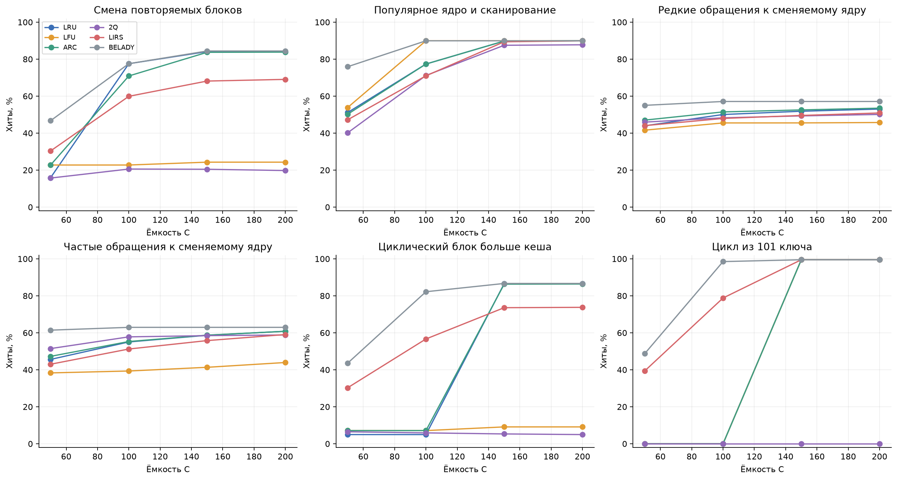

Сценарии побед привязаны к соотношению ёмкости и размера рабочего набора. Например, цикл из 101 ключа разрушителен для LRU при C = 100, но при C = 150 полностью помещается и после первого прохода даёт хиты. Для 2Q порог дополнительно определяется размерами отдельных очередей: равный общий параметр C не гарантирует одинаковую доступную ёмкость для конкретного типа обращений. Исходные числа всех десяти сценариев доступны в [capacity.csv](data/capacity.csv).

## 7. Дополнительное сравнение ёмкости 2Q

Для приблизительного выравнивания числа резидентных значений 2Q отдельно запущен с C = 143: IN = 14, LRU = 85, всего 99 значений, OUT = 42 ключа истории. Остальные кеши остаются с C = 100. Это проверка чувствительности результата к бюджету значений; служебная память в байтах по-прежнему не выровнена.

| Датасет | 2Q, C=100 (70 значений) | 2Q, C=143 (99 значений) | Лучший онлайн при C=100 |
| --- | --- | --- | --- |
| uniform | 3476 | 4953 | 5114 |
| zipf | 16160 | 16919 | 17149 |
| normal | 7179 | 9732 | 10314 |
| scan | 0 | 0 | 0 |
| lru | 5339 | 5347 | 20122 |
| lfu | 12058 | 14609 | 15237 |
| arc | 11065 | 11255 | 11795 |
| twoq | 17191 | 17356 | 17191 |
| lirs | 1827 | 1684 | 17605 |
| belady | 0 | 0 | 15920 |

Увеличение доступной ёмкости заметно улучшает 2Q на равномерном, нормальном распределениях и распределении Ципфа. В целевом сценарии `twoq` он сохраняет преимущество. На сценарии `lirs` число хитов 2Q, напротив, немного уменьшается: изменение размеров очередей меняет путь допуска ключей, поэтому для этой реализации не следует автоматически предполагать монотонный рост результата на любой трассе.

## 8. Исследование иерархий

Использован непосредственно класс `CacheHierarchy` и JSON-конфигурации проекта. Стрелка обозначает путь запроса от первого уровня ко второму: при хите L1 уровень L2 не вызывается. При сквозном промахе загруженный ключ сохраняется на обоих уровнях. Уровни могут содержать одинаковые ключи; сумма ёмкостей не равна числу уникальных ключей, доступных иерархии.

Сравниваются одноуровневый LRU(100) и четыре конфигурации с суммарной резидентной ёмкостью 100: LRU(50) → LRU(50), LRU(20) → LFU(80), LRU(20) → ARC(80), LRU(20) → LIRS(80). Белади в иерархию не включён: класс проекта явно запрещает такой вариант.

Здесь **хит иерархии** — запрос, обслуженный любым её уровнем без обращения к внешнему загрузчику. Метрика равна N минус число сквозных промахов; хиты уровней не считаются повторно. Внутренние задержки уровней и стоимость обращений не моделируются.

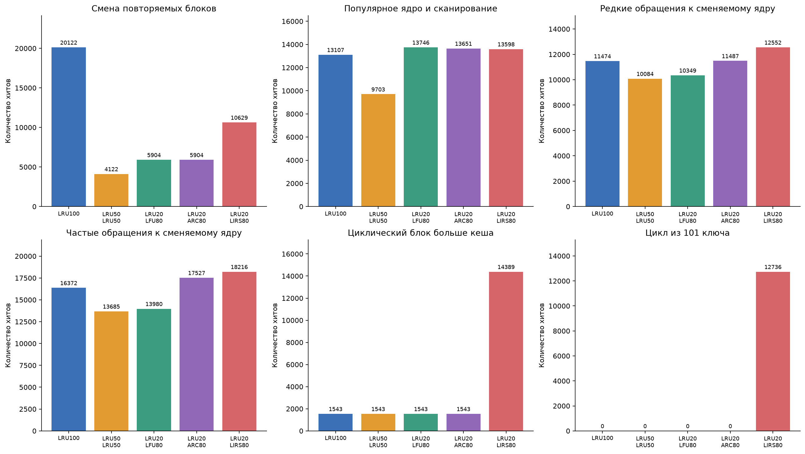

| Датасет | LRU100 | LRU50 → LRU50 | LRU20 → LFU80 | LRU20 → ARC80 | LRU20 → LIRS80 |
| --- | --- | --- | --- | --- | --- |
| uniform | 5070 | 2687 | 4250 | 4038 | 4097 |
| zipf | 16543 | 14914 | 16691 | 16423 | 16436 |
| normal | 9058 | 5067 | 8535 | 7725 | 7985 |
| scan | 0 | 0 | 0 | 0 | 0 |
| lru | 20122 | 4122 | 5904 | 5904 | 10629 |
| lfu | 13107 | 9703 | 13746 | 13651 | 13598 |
| arc | 11474 | 10084 | 10349 | 11487 | 12552 |
| twoq | 16372 | 13685 | 13980 | 17527 | 18216 |
| lirs | 1543 | 1543 | 1543 | 1543 | 14389 |
| belady | 0 | 0 | 0 | 0 | 12736 |

На `twoq` связка LRU(20) → LIRS(80) даёт **18 216** хитов против **16 372** у одного LRU(100). Первый уровень поглощает близкие повторные обращения, поэтому на второй поступает другой поток, чем в одноуровневом эксперименте. Результат LIRS на полном исходном потоке нельзя непосредственно переносить на LIRS второго уровня.

На `lru`, наоборот, один LRU(100) получает **20 122** хита, а LRU(50) → LRU(50) — лишь **4122**. Разделение ёмкости и дублирование ключей мешают удерживать целиком блок из 100 ключей. Дополнительный уровень сам по себе не гарантирует повышения доли хитов.

Из этих измерений нельзя сделать вывод об ускорении в наносекундах: иерархия с меньшей суммарной долей хитов иногда может иметь выгодную задержку L1, но для проверки нужны отдельные измерения стоимости доступа.

## 9. Воспроизводимость и проверки

Все основные последовательности сохранены в `report/data/*.txt`. Формат совместим с вводом основной программы проекта:

```text
<ёмкость> <число запросов>
<ключ 1> <ключ 2> ... <ключ N>
```

[manifest.json](data/manifest.json) содержит длины, число уникальных ключей и SHA-256 сохранённых файлов. [results.csv](data/results.csv) содержит все 600 строк измерений: 10 датасетов × 10 seed × 6 алгоритмов. Конфигурации иерархий находятся в [configs](configs/), сведения о компиляторе и среде — в [environment.json](data/environment.json).

Для повторения из корня репозитория нужны C++20-компилятор, Python 3.10+ и Matplotlib. Версия Matplotlib, использованная в работе, зафиксирована в `experiments/requirements.txt` (для неё требуется Python 3.11+). Например:

```bash
python3 -m venv .venv
source .venv/bin/activate
python3 -m pip install -r experiments/requirements.txt
python3 experiments/run.py
```

По умолчанию заголовки nlohmann/json берутся из уже загруженной зависимости `build/_deps/json-src/single_include`. Если она расположена иначе:

```bash
python3 experiments/run.py --cxx clang++ --json-include /path/to/json/single_include
```

Скрипт самостоятельно собирает два экспериментальных исполняемых файла во временном каталоге, генерирует датасеты, выполняет измерения и обновляет CSV, JSON и все рисунки отчёта. Для другого компилятора можно указать `--cxx g++`. Текст интерпретации в этом Markdown зафиксирован для приведённых результатов; при изменении алгоритмов его нужно пересмотреть.

Проверки при подготовке работы:

- 83 существующих unit-теста пересобраны из текущих исходников и успешно пройдены.
- Все десять основных трасс дополнительно выполнены с AddressSanitizer и UndefinedBehaviorSanitizer без сообщений об ошибках.
- Загрузчик независимо считает промахи; стенды сверяют их со счётчиками кеша и проверяют возвращаемые значения.
- Для всех основных запусков проверено 0 ≤ H ≤ H_Белади ≤ N.
- Контроль «пять ключей, сто повторов» даёт ровно 495 хитов у каждого алгоритма; однократный проход даёт ноль.
- Результат одноуровневой иерархии LRU(100) совпал с прямым запуском LRU на всех десяти основных датасетах.

В имеющемся локальном каталоге `build` обнаружено несоответствие генератора CMake: сборка ожидала отсутствующий `build.ninja`. Поэтому unit-тесты пересобраны напрямую с локальными исходниками GoogleTest. Экспериментальные стенды не зависят от этого состояния CMake.

## 10. Выводы

1. Распределение вероятностей определяет ценность удержания популярных ключей: на стационарных распределениях Ципфа и нормальном LFU получил больше хитов, чем остальные онлайн-кеши.
2. Порядок обращений не менее важен, чем частоты. Цикл длиной C + 1 и смена полностью помещающихся блоков приводят к принципиально разным результатам LRU.
3. Для каждого онлайн-алгоритма найден и сохранён отдельный датасет со строгим превосходством над остальными онлайн-алгоритмами. Победы сохранились на всех десяти проверенных seed.
4. LRU эффективен при быстрой смене помещающихся рабочих блоков; LFU — при устойчивой популярности; ARC — на выбранной адаптивной смеси; 2Q — при сочетании повторно используемого ядра и кратких серий новых ключей; LIRS — на циклических блоках чуть больше ёмкости.
5. Белади служит эталоном доступного числа хитов при знании будущего. На отдельных трассах LRU и LFU достигают этого эталона, но на цикле из 101 ключа Белади строго превосходит все исследуемые онлайн-кеши.
6. Двухуровневая иерархия меняет поток запросов нижнего уровня. При равной сумме ёмкостей она может как улучшать, так и ухудшать результат относительно одного кеша.
7. Выбирать алгоритм следует с учётом распределения, временной структуры и размера рабочего набора. Для переноса результатов на практическую систему нужны её реальные трассы и отдельная оценка служебной памяти и задержек.
